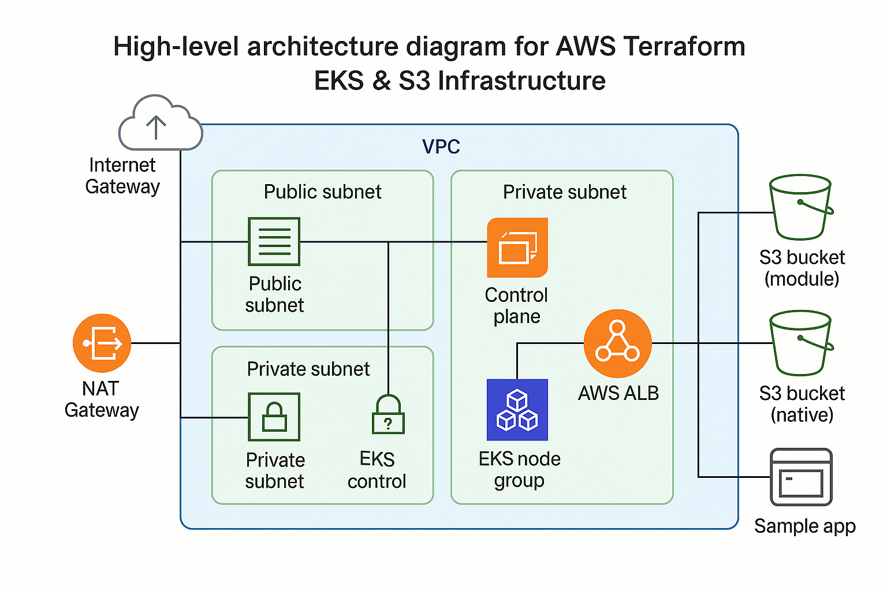

# terraform-buckets-eks-auto-mode

 

> A self-contained IaC example that goes from zero to a fully functional AWS environment—complete with secure S3 storage, resilient networking, a private EKS cluster in Auto Mode, and a sample app deployment.

---

## Table of Contents

* [Overview](#overview)
* [Features](#features)
  * [S3 Bucket Provisioning](#s3-bucket-provisioning)
  * [VPC Networking](#vpc-networking)
  * [EKS Cluster (Auto Mode)](#eks-cluster-auto-mode)
  * [Kubernetes Sample App](#kubernetes-sample-app)
* [Prerequisites](#prerequisites)
* [Architecture Diagram](#architecture-diagram)
* [Usage](#usage)
  * [Terraform](#terraform)
  * [Kubernetes](#kubernetes)
* [Testing](#testing)
* [Best Practices](#best-practices)
* [Contact](#contact)

---

## Overview

This repository, **terraform-buckets-eks-auto-mode**, is a self-contained Infrastructure-as-Code (IaC) example that shows how to provision a secure, production-ready AWS environment. It includes:

* **Dual S3 Bucket Provisioning**
* **Custom VPC Networking**
* **Private EKS Cluster in Auto Mode**
* **Sample Kubernetes App Deployment**

---

## Features

### S3 Bucket Provisioning

* **Native Buckets**: Uses a `random_id` + `for_each` pattern to spin up N buckets with:

  * AES-256 encryption
  * Versioning enabled
  * Strict public-access block
* **Module-based Buckets**: Demonstrates the same compliance requirements using the popular [`terraform-aws-modules/s3-bucket`](https://github.com/terraform-aws-modules/terraform-aws-s3-bucket) for comparison.

### VPC Networking

* Builds a VPC with DNS support
* Creates two public subnets (with an Internet Gateway)
* Creates two private subnets (with a NAT Gateway)
* Configures route tables and associations so:

  * Public subnets route to the IGW
  * Private subnets route through the NAT

### EKS Cluster (Auto Mode)

* Deploys a fully private control plane (`public_access = false, private_access = true`)
* Creates an on-demand node group across private subnets with configurable min/max/desired capacity
* Bootstraps the `aws-auth` ConfigMap for IAM-based Kubernetes authentication

### Kubernetes Sample App

At the repo root there’s a `k8s.yaml` manifest that:

* Creates a Namespace for isolation
* Deploys 5 replicas of the `app-chat` container with CPU requests
* Exposes them via a ClusterIP Service on port 80
* Defines an IngressClass for the AWS Load Balancer Controller
* Configures an Ingress resource annotated to provision an internet-facing ALB routing `/` to your service

---

## Prerequisites

* AWS CLI configured with appropriate IAM permissions
* Terraform CLI (v1.4+)
* kubectl (v1.27+)
* AWS Load Balancer Controller installed in the cluster

---

## Architecture Diagram



---

## Usage

### Terraform

```bash
git clone https://github.com/ShalevBohadana/terraform-buckets-eks-auto-mode.git
cd terraform-buckets-eks-auto-mode
terraform init
terraform plan
terraform apply
```

### Kubernetes

```bash
kubectl apply -f k8s.yaml
```

---

## Testing

1. Retrieve the ALB DNS:

   ```bash
   kubectl describe ingress -n default
   ```
2. Curl the DNS to confirm your app UI:

   ```bash
   curl http://<alb-dns>
   ```

---

## Best Practices

* Enforce S3 encryption & versioning
* Block public ACLs & policies on all buckets
* Use private-only EKS control plane for security
* Manage Kubernetes auth via IAM Roles and ConfigMap

---

## Contact

Created by [Shalev Bohadana](mailto:bohadanashalev@gmail.com).
Have questions or feedback? email me directly.
> *Crafted by Shalev Bohadana as a portfolio project demonstrating enterprise-grade DevOps practices.*